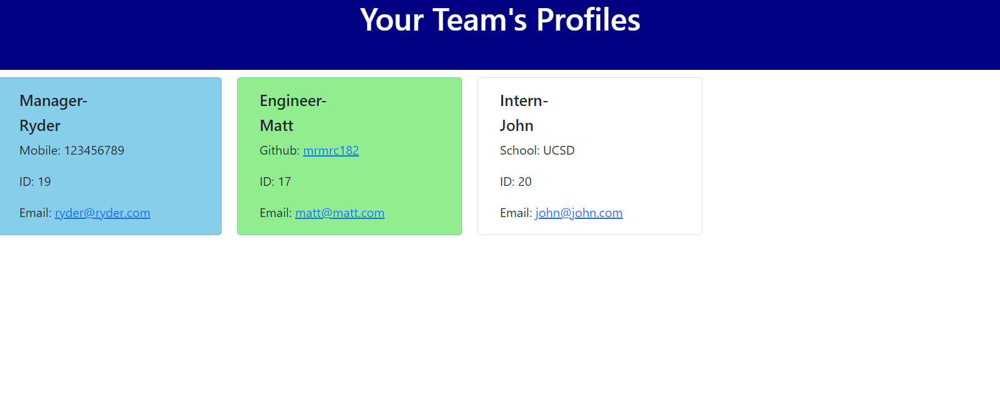

# dynamic-teamsite-maker

## Description
This is a team profile generator.  When the user enters prompts into the command line, they can answer specific questions about the team members they want to display.  When they are finished, a site is dynamically created to show all the necessary data for their team members and employees in one location.

Although elements of it were fairly similar to the Readme Generator assignment, this was much more challening.  For example, I had difficulty linking the dynamic generation of elements with the array.  But after completing it, I feel as though I have a stronger grasp on how to work with Classes in Javascript, as well as creating my own dynamically generated elements.

## Contributors
I wrote all of the code, but also received help from my instructor John, TA Michael, and utilized the help of several kind BCS tutors.

## Testing
To use this application, [refer to this video](https://drive.google.com/file/d/1W6scgm3gqb0tr7L7XgUrYvpEKcUEAVpB/view) for a quick and easy guide.  There is also a screenshot below of what the site should look like when running properly.

;

## License
Matt Carlson Code, 2022